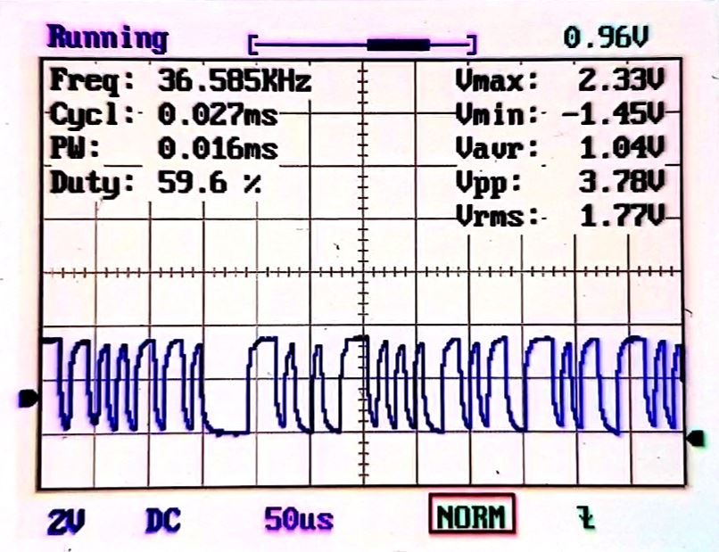

# Extraction and static analysis of IoT device firmware

This repository is about the project done for the "Information Security M" course at the University of Bologna (UNIBO). The project shows how it is possible to extract a firmware from a device (esplecially IoT devices) and then perform a static analysis of it.

## Repository content

- The final project report (italian)

- The slides used for the project presentation at [ULISSE](https://ulisse.unibo.it/). A video of the presentation is available [here](https://youtu.be/dVbtmHg22Ds) (italian)

- The firmware extracted and analyzed in the project

Below you will find a small excerpt from the report where it is explained how I extracted a modem firmware.

## Alice Gate 2 Plus firmware dump


### Information Gathering

This gateway was produced by “Industrie Dial Face” and distributed in Italy by
“Telecom Italia” at the end of the 2000s.


In the above image are highlighted:

1. The SoC is a PSB 50501 which has a 32-bit MIPS 4KEc RISC architecture and a working frequency of 235 MHz

2. The RAM is a 128Mb Samsung K4S281632K-UC75 8M x 16Bit x 4 Banks SDRAM with a maximum frequency of 133 MHz

3. The flash memory is a Spansion S29GL064 8Mb size

4. The integrated circuit LVC574A (useful to find UART power voltage Vcc)

### How the firmware has been dumped

One method to dump a firmware is using an open debugging interface, as the UART, and try to extract the firmware through the system shell or the bootloader shell. Unfortunately, there is not any documentation of this gateway, so we must locate the UART interface.

### Locatingthe UART interface

On the board’s lower bound there are four pins that could correspond to the UART interface. To verify them we can measure the resistance between each pin and ground, between each pin and Vcc, and finally measure the voltage of each pin.

| Pin | Rgnd (Ω) | Rvcc (Ω) | V (V) | Notes        |
|:---:|:--------:|:--------:|:-----:|:------------:|
| 1   | ∞        | ∞        | 0     | N.C.         |
| 2   | 1.39K    | 1.52K    | 3.36  | TX suspected |
| 3   | 1.37K    | 1.48K    | 3.33  |              |
| 4   | 104.5    | 0        | 3.37  | Vcc          |

Thanks to these measures, we can affirm that pin 1 is a not connected pin and pin 4 is the Vcc. We do not have enough data to identify the TX and RX pins but during the boot process we have observed an oscillating voltage on pin 2, It could mean that the second pin is the transmitting pin which print some information during the boot process. To confirm this hypothesis it can be used an oscilloscope (or a logic analyzer) connected to the suspecting pin.



In the above image it is possible to identify a square signal that confirms our hypothesis, so we have found the sequent pinout:

| Pin | UART |
|:---:|:----:|
| 1   | N.C. |
| 2   | Tx   |
| 3   | Rx   |
| 4   | Vcc  |

### Extracting the firmware

One method to extract a firmware is trying to access to the bootloader shell to use the available commands that allow us to read the flash memory. To do this, we have used a Raspberry Pi Zero W to connect to the modem through the UART interface.


Once connected we can see a lot of information printed while device booting and, at the end, a prompt to stop autoboot. We can press the enter key to stop autoboot and gain access to the bootloader shell. Among the available command there is the `flinfo` command, useful to find out what are the addresses corresponding to the flash memory addresses, and the `md` (memory display) command to print memory content of one or more address.

With the following command is possible to retrieve the whole memory content and save it into a file:

```shell
sudo picocom /dev/ttyS0 -b 115200 -g dump.txt
```

Then, with this command is possible to transform the dump file in a real binary file:

```shell
egrep -o '([a-f|0-9]{2} ){15}[a-f|0-9]{2}' dump.txt | xxd -r -p > alice.bin
```
